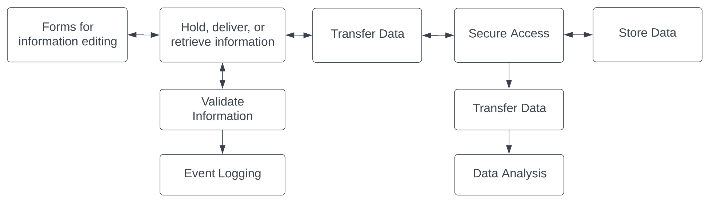
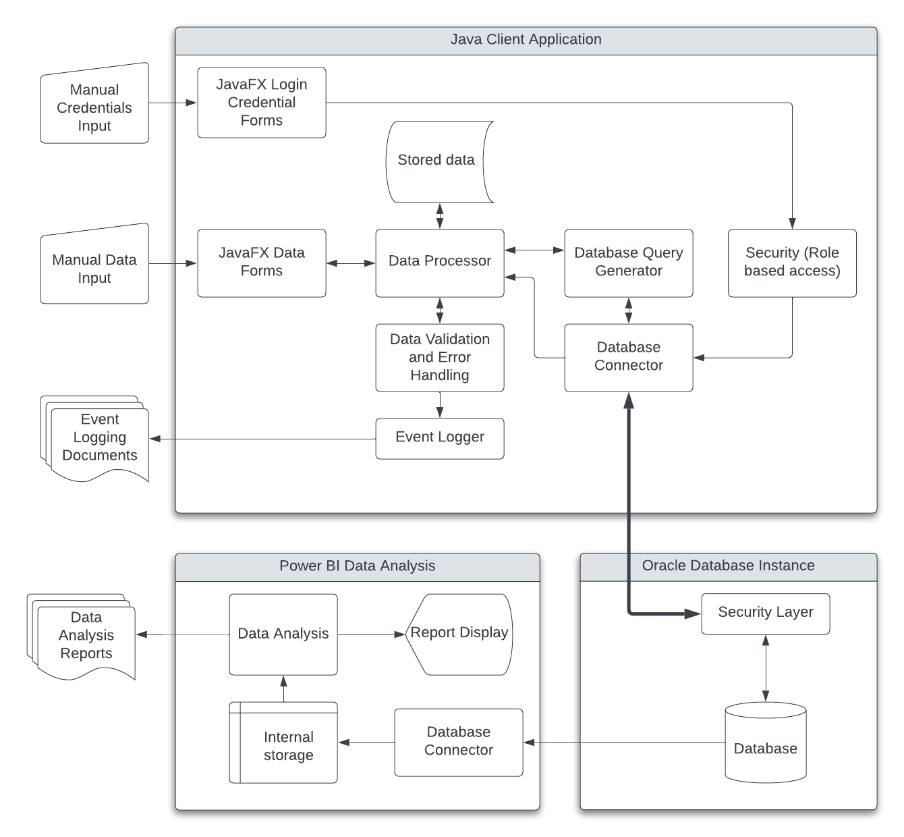

# Student Information Tracking System
The system stores student information on a cloud based database from which the data can be remotely accessed or edited using a java based client.

### Functional Diagram

The functional goal of the system is to allow users to access and edit student data at which point the data are validated and transferred to a secure storage medium. From there the data should be accessible for real-time analysis.

### System Overview

The system consists of java based client running on a workstation, and a database used as data storage medium which is accessed through internet or LAN for editing or analysis purposes by various users with defined privileges.

### System Architecture Diagram

Further detailed inner working of the java based client application are shown along with the database and the data analysis medium.

### Database Diagram

Detailed diagram of the database tables used to store student data.

### User Client Application Interface
Below are shown a series of sample screenshots of the java based client application with sample data included.

