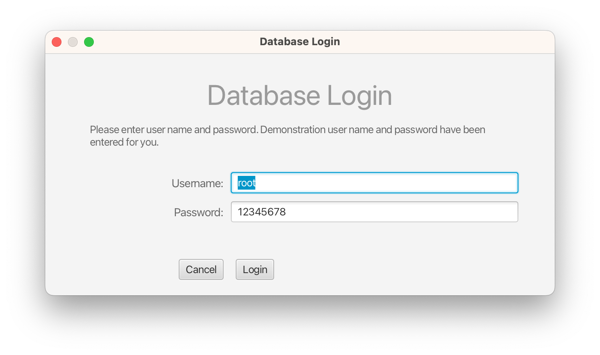
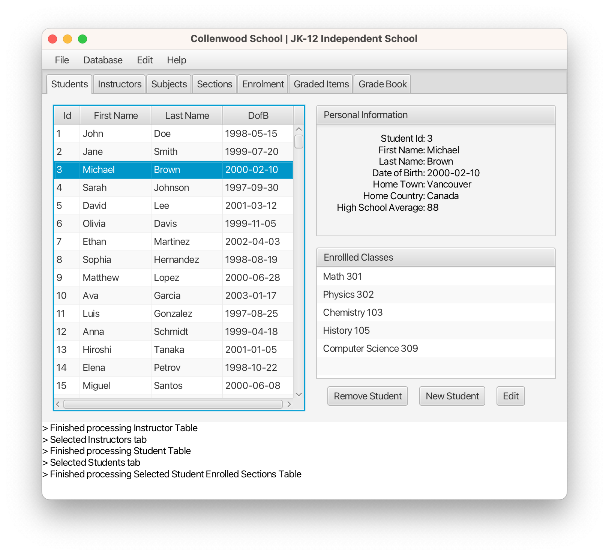
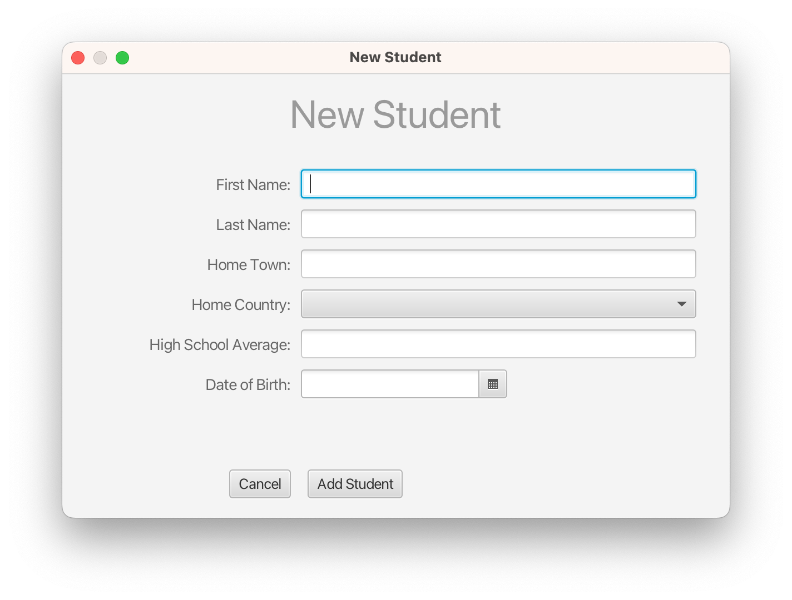
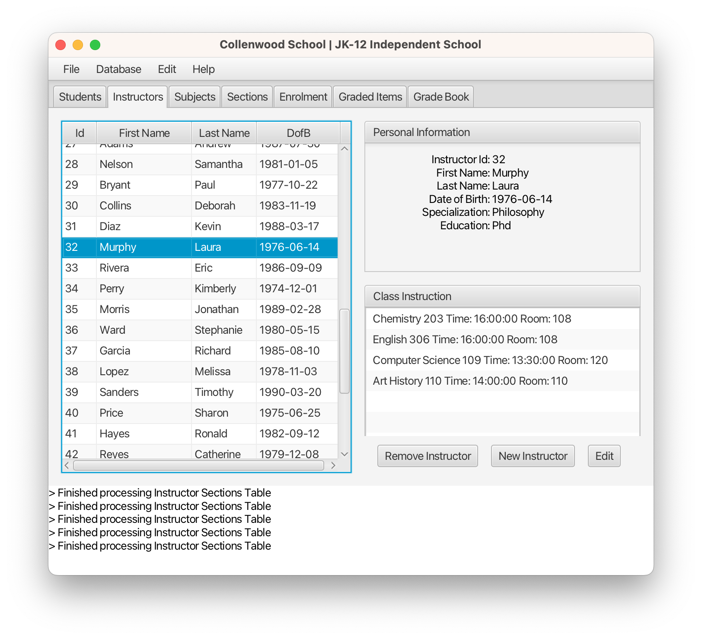
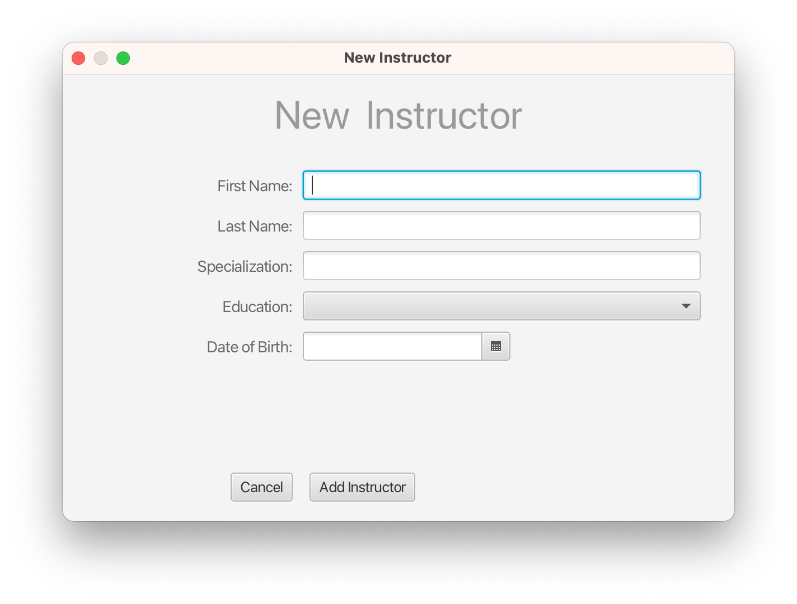

# Student Information Tracking System
The system stores student information on a cloud based database from which the data can be remotely accessed or edited using a java based client.

## Project Description
A comprehensive solution for schools to track classes, instructor, and student information. Includes a Java platform independent application for the management of all critical facets of educational institutional operations, ensuring streamlined workflows and improved productivity. The main features are as follows:
- Create/Edit subjects with scheduled sections
- Add/Edit instructors and students
- Assign instructors to sections
- Instructors can create custom marked items for each section
- Enrol students in class sections
- Automatic performance reports are generated for sections, students, and instructors

### - Functional Diagram

The functional goal of the system is to allow users to access and edit student data at which point the data are validated and transferred to a secure storage medium. From there the data should be accessible for real-time analysis.

### - System Overview

The system consists of java based client running on a workstation, and a database used as data storage medium which is accessed through internet or LAN for editing or analysis purposes by various users with defined privileges.

### - System Architecture Diagram

Further detailed inner working of the java based client application are shown along with the database and the data analysis medium.

### - Database Diagram

Detailed diagram of the database tables used to store student data.

### - User Client Application Interface
Below are shown a series of sample screenshots of the java based client application with sample data included.


## Table of Contents
1. [Installation](#installation)
2. [Features](#eatures)
3. [Usage](#usage)
4. [Contributing](#contributing)
5. [License](#license)
6. [Authors and Acknowledgments](#authors-and-acknowledgments)
7. [Contact Information](#contact-information)
8. [Badges](#badges)
9. [Changelog](#changelog)
10. [FAQ](#faq)

## Installation
Follow these steps to set up and run the Java application with a MySQL database:

### Prerequisites

1. **Java Development Kit (JDK)**: Ensure you have JDK installed. You can download it from [here](https://www.oracle.com/java/technologies/javase-jdk11-downloads.html).

2. **MySQL Database**: Install MySQL Server. You can download it from [here](https://dev.mysql.com/downloads/mysql/).

3. **Maven**: Ensure you have Maven installed for managing the project dependencies. You can download it from [here](https://maven.apache.org/download.cgi).

### Step-by-Step Instructions

1. **Clone the Repository**:
    ```sh
    git clone https://github.com/phancak/Student-Information-Tracking-System-Java-Client.git
    cd repo
    ```

2. **Set Up MySQL Database**:
    - Start the MySQL server.
    - Create a new database:
        ```sql
        CREATE DATABASE School;
        ```
    - Create a new 'root' user with pass '12345678' and grant necessary privileges if it does not already exist:
        ```sql
        CREATE USER 'root'@'localhost' IDENTIFIED BY '12345678';
        GRANT ALL PRIVILEGES ON School.* TO 'root'@'localhost';
        FLUSH PRIVILEGES;
        ```
    - Run 'School_Init.sql' to setup database tables, procedures, and views
    - Run 'School_Init.sql' to initialize the database with sample data


3. **Configure the Application**:
    - Update the `application.properties` (or `application.yml` if you're using YAML) file with your MySQL database configuration:
        ```properties
        spring.datasource.url=jdbc:mysql://localhost:3306/my_database
        spring.datasource.username=my_user
        spring.datasource.password=my_password
        spring.jpa.hibernate.ddl-auto=update
        ```

4. **Build the Project**:
    - Navigate to the project directory and build the project using Maven:
        ```sh
        mvn clean install
        ```

5. **Run the Application**:
    - Run the Java application:
        ```sh
        mvn spring-boot:run
        ```

## Features

- **Instructor Management**
    - Create and manage instructor profiles including their personal information, specialization, and educational background.

- **Subject Management**
    - Create and manage subjects including subject names, numbers, and descriptions.

- **Student Management**
    - Add and manage student profiles including personal information and high school average.

- **Section Management**
    - Create and manage sections for subjects, including the start and end times, room, and days of the week.
    - Assign instructors to sections.

- **Enrollment Management**
    - Enroll students into sections.
    - Automatically enroll students in random sections based on specified criteria.

- **Graded Item Management**
    - Create and manage graded items for each section, including titles, descriptions, and dates.

- **Grade Book**
    - Generate and manage a grade book that combines graded items with student enrollments.
    - Populate grade books with randomly generated grades based on statistical models.

- **Procedures and Views**
    - Utilize stored procedures for complex operations like enrollment initialization, grade book population, and generating graded item averages.
    - Access detailed information on sections, instructors, and subjects through views.

- **Data Integrity and Constraints**
    - Ensure data integrity with primary keys, foreign keys, and check constraints.
    - Cascade updates and deletes to maintain consistent data relationships.

## Usage

This section provides detailed instructions on how to use the School Management System application. The application allows users to manage various aspects of a school's operations, including students, instructors, subjects, sections, enrollment, and graded items.

### 1. Launching the Application

1. **Start the MySQL Server**
    - Ensure that your MySQL server is running. If it's not, start it using the appropriate command for your operating system.

2. **Run the Java Application**
    - Open your terminal or command prompt.
    - Navigate to the directory where your Java application JAR file is located.
    - Execute the following command to run the application:
      ```bash
      java -jar schoolApp.jar
      ```

### 2. Main Dashboard

Once the application is running, you will see a database login window. Enter the login credentials and the main dashboard will open. Here, you can navigate to different sections of the application.



### 3. Managing Students

**View Students:**
1. Go to the "Students" tab.
2. The list of students enrolled in the institution will be displayed. You can click on individual students for more personal information and their class enrolment.



**Add a New Student to institution:**
1. Go to the "Students" tab.
2. Click on the "New Student" button.
3. Fill in the required details (First Name, Last Name, Date of Birth, Home Town, Home Country, High School Average).
4. Click "Add Student".



**Edit/Remove Existing Student:**
1. Go to the "Students" tab.
2. Click on the "Remove Student" or "Edit" button.

### 4. Managing Instructors

**View Instructors:**
1. Go to the "Instructors" tab.
2. The list of available instructors will be displayed.



**Add a New Instructor:**
1. Go to the "Instructors" section.
2. Click on the "Add Instructor" button.
3. Fill in the required details (First Name, Last Name, Date of Birth, Specialization, Education).
4. Click "Save".



**Edit/Remove Existing Instructor:**
1. Go to the "Instructors" tab.
2. Click on the "Remove Instructor" or "Edit" button.


### 5. Managing Subjects

**Add a New Subject:**
1. Go to the "Subjects" section.
2. Click on the "Add Subject" button.
3. Fill in the required details (Name, Number, Description).
4. Click "Save".


**View Subjects:**
1. Go to the "Subjects" section.
2. The list of subjects will be displayed.


### 6. Managing Sections

**Add a New Section:**
1. Go to the "Sections" section.
2. Click on the "Add Section" button.
3. Fill in the required details (Instructor, Subject, Start Time, End Time, Room, Days).
4. Click "Save".


**View Sections:**
1. Go to the "Sections" section.
2. The list of sections will be displayed.


### 7. Enrolling Students in Sections

1. Go to the "Enrollment" section.
2. Select a section from the dropdown menu.
3. Choose a student to enroll from the list.
4. Click "Enroll".


### 8. Managing Graded Items

**Add a New Graded Item:**
1. Go to the "Graded Items" section.
2. Click on the "Add Graded Item" button.
3. Fill in the required details (Title, Description, Date).
4. Click "Save".


**View Graded Items:**
1. Go to the "Graded Items" section.
2. The list of graded items will be displayed.


### 9. Viewing and Entering Grades

1. Go to the "Grade Book" section.
2. Select a section to view its graded items and students.
3. Enter grades for each student and graded item.
4. Click "Save" to update the grades.


### 10. Generating Reports

1. Go to the "Reports" section.
2. Select the type of report you want to generate (e.g., Student Grades, Section Averages).
3. Click "Generate Report".


### 11. Advanced Database Operations

For advanced users, the application provides options to directly interact with the database for tasks like bulk imports, exports, and custom queries.

**Database Backup:**
1. Go to the "Database" section.
2. Click "Backup".


**Custom SQL Queries:**
1. Go to the "SQL" section.
2. Enter your SQL query.
3. Click "Execute".


### 12. Help and Support

If you encounter any issues or need assistance, refer to the "Help" section within the application. You can also contact our support team via email at support@example.com.


---

With these instructions, you should be able to effectively navigate and use the School Management System application. If you have any questions or feedback, please do not hesitate to reach out.


## Contributing
Guidelines for contributing to the project.

## License
This project is licensed under the MIT License.

## Authors and Acknowledgments
- **Author Name** - Initial work
- **Contributor Name** - Additional contributions

## Contact Information
For any inquiries, please contact [your-email@example.com](mailto:your-email@example.com).

## Badges
[](https://travis-ci.org/username/repo)
[](https://coveralls.io/github/username/repo?branch=master)

## Changelog
- v1.0.0 - Initial release

## FAQ
**Q:** How do I set up the project?  
**A:** Follow the installation instructions above.